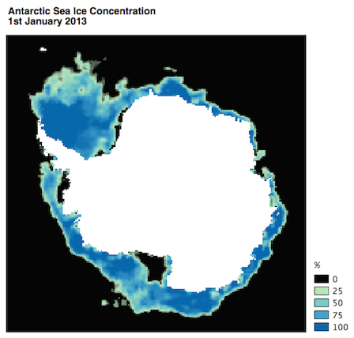

Sea Ice Concentration Downloader v1.0.0
=======================================

##What it does
This is a QGIS Plugin which allows easy download of sea ice concentration data from [NSIDC](http://nsidc.org/data/seaice_index/) (National Snow and Ice Data Centre). 

It downloads daily sea ice concentration grids within a defined time range together with an optional averaged composite of all downloaded data. The data is saved in GeoTiff format, and projected to Antarctic Polar Stereographic (EPSG: 3031). 

The Plugin is currently working, but has not been subject to wide use. Therefore, there may be problems with it. 

##The data
The data is sourced from [NSIDC](http://nsidc.org/data/nsidc-0051). For full details on the input data, please refer to the [official documentation.](http://nsidc.org/data/docs/daac/nsidc0051_gsfc_seaice.gd.html) 

The valid date range is from 1978/10/26 to 2013/12/31.

##Installation

The plugin requires QGIS version 2.0 or higher. It can be installed via the Plugin Manager. 

1. Navigate to `Plugins > Manage and Install Plugins...`
2. Click `Settings`
3. Add the following repository:

    http://plugins.remotesensing.io/plugins.xml?qgis=2.4

4. Click on `New` to see all newly available plugins. 
5. Install the plugin, name Sea Ice Concentration Downloader.

##Using the plugin
1.   Locate this icon on the toolbar and click it to open the plugin.

2. Select a date **range** and **download path**. Select whether you want to create an averaged **composite** and whether you wish to add the composite to the map canvas. 

3. Click **Download**

WARNING: There are no warnings for large downloads. It is likely to fail if attempting to make a composite from a large date range.

 
